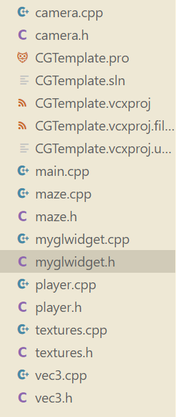

对于迷宫文件的分析：

这些文件共同组成了一个基于 **OpenGL** 和 **Qt** 的迷宫渲染与交互应用。以下是对每个文件的作用分析：

---

### 主要代码文件（源文件和头文件）
1. **camera.cpp/camera.h**  
   - **作用**：实现了摄像机的相关功能，如视角移动、位置更新等。用于处理玩家视角的操控。

2. **maze.cpp/maze.h**  
   - **作用**：管理迷宫的结构、生成和绘制逻辑。包括墙壁、陷阱、通道等的表示。
   - **特点**：可能存储了迷宫的二维数组或类似数据结构，表示每个单元格的类型。

3. **myglwidget.cpp/myglwidget.h**  
   - **作用**：核心绘图逻辑所在的文件，继承自 `QOpenGLWidget`，实现了 OpenGL 的初始化、绘制、交互（键盘/鼠标事件）以及动态效果。
   - **关键功能**：
     - 初始化 OpenGL 环境。
     - 实现迷宫、天空盒、玩家角色等场景的绘制。
     - 更新动态效果（如跳跃、下落、光源移动等）。
     - 处理键盘和鼠标事件，控制玩家移动或视角。
     - 包括小地图的绘制功能。

4. **player.cpp/player.h**  
   - **作用**：管理玩家角色的行为逻辑，包括移动、状态变化（如跳跃、飞行等）和与迷宫的交互。
   - **特点**：可能持有玩家的当前位置、速度、跳跃状态等信息。

5. **textures.cpp/textures.h**  
   - **作用**：加载和管理纹理资源，负责将图像文件绑定为 OpenGL 的纹理以供绘制使用。
   - **特点**：可能有支持 2D 和立方体贴图（天空盒）的纹理加载功能。

6. **vec3.cpp/vec3.h**  
   - **作用**：定义了三维向量类，用于表示位置、方向、速度等向量数据。
   - **特点**：提供基本的向量运算支持。

---

### 工程配置文件
7. **CGTemplate.sln**  
   - **作用**：Visual Studio 的解决方案文件，用于组织工程。
   - **特点**：包含项目 `CGTemplate` 的构建配置，如 Debug 和 Release 模式。

8. **CGTemplate.pro**  
   - **作用**：Qt 工程文件，用于定义项目的依赖、源文件、头文件以及额外资源文件。
   - **特点**：
     - 指定了使用的模块：`core gui opengl widgets`。
     - 包含头文件（如 `camera.h`）、源文件（如 `camera.cpp`）以及分发的纹理文件（如 `wall1.bmp`）。

9. **CGTemplate.vcxproj**  
   - **作用**：Visual Studio 的项目文件，定义了编译和链接的详细配置。
   - **特点**：
     - 指定了包括 `OpenGL32.lib` 和 `Glu32.lib` 等在内的依赖库。
     - 配置了头文件和库的搜索路径（如 `glew-2.1.0`）。

10. **CGTemplate.vcxproj.filters**  
    - **作用**：用于在 Visual Studio 中组织文件，提供了逻辑上的文件分组。
    - **特点**：
      - 将 `.cpp` 文件归为 `Source Files`。
      - 将 `.h` 文件归为 `Header Files`。
      - 将纹理文件（如 `blue_bk.bmp`）归为 `Distribution Files`。

11. **CGTemplate.vcxproj.user**  
    - **作用**：存储用户特定的项目配置（如调试设置）。
    - **特点**：未定义具体配置。

---

### 资源文件
12. **纹理文件（如 `blue_bk.bmp`、`wall1.bmp`）**
    - **作用**：用于绘制迷宫、天空盒、陷阱等。
    - **特点**：提供不同的纹理图像，增加场景的视觉效果。

---

### 小结
这个项目是一个以 **Qt** 为界面框架、**OpenGL** 为图形渲染核心的 3D 迷宫游戏/模拟器：
- 核心类如 `MyGLWidget` 负责绘图、交互和动态效果。
- 辅助类如 `Player` 和 `Camera` 提供了玩家移动和视角操作的支持。
- `Maze` 管理迷宫逻辑和数据。
- `Textures` 提供纹理加载和管理功能。

---

`maze.h`和`maze.cpp`文件的分析如下：

### 文件分析

#### 1. **类定义：Maze**
`Maze` 类主要负责迷宫的生成、结构管理及相关逻辑判断。

##### **成员变量**
- **基本属性**
  - `Height, Width`: 迷宫的高度和宽度。
  - `xOrigin, yOrigin`: 迷宫的起点坐标。
  - `xEnd, yEnd`: 迷宫的终点坐标。
  - `maze[100][100]`: 二维数组表示迷宫的结构。
  - `blockHeight[100][100]`: 每个迷宫单元格的高度，主要用于渲染和物理模拟（例如跳跃检测）。
  - `isDynamicWall[100][100]`: 指示迷宫的墙是否是动态墙壁。
  - `dynamicWallProportion`: 动态墙壁的比例。
  - `wallsize`: 每个迷宫单元格（墙体或通道）的大小。
  
- **纹理管理**
  - `Textures textures`: 负责纹理加载和管理，用于绘制迷宫的墙壁、通道、陷阱等。

##### **构造与析构函数**
- **`Maze(int height, int width)`**
  - 初始化迷宫的基本参数，如高度、宽度、起点、终点。
  - 调用随机生成算法（`randGo`）生成迷宫的结构。
  - 初始化 `isDynamicWall`，随机生成动态墙壁。
  - 生成特殊单元（矮墙、陷阱、金币）。

- **`~Maze()`**
  - 析构函数，无特殊清理逻辑。

##### **成员函数**
1. **`isArea(int x, int y)`**
   - 检查指定坐标是否在迷宫的范围内。

2. **`isWall(int x, int y)`**
   - 判断指定位置是否是墙体。

3. **`isTrap(int x, int y)`**
   - 判断指定位置是否是陷阱。

4. **`isLowWall(int x, int y)`**
   - 判断指定位置是否是矮墙。

5. **`isMoney(int x, int y)`**
   - 判断指定位置是否是金币。

6. **`isValid(int x, int y, int z)`**
   - 判断某位置是否是玩家可到达的位置（需要考虑高度 `z` 和地形）。

7. **`randGo(int x, int y)`**
   - 随机迷宫生成算法，采用深度优先算法生成迷宫路径。
   - 包括：
     - 初始化一个二维数组 `tmpMaze`，用来临时生成迷宫结构。
     - 利用一个墙队列随机生成路径。
     - 根据路径生成迷宫并填充墙体。
   - 进一步添加了动态墙壁、矮墙、陷阱和金币。

8. **`LoadTexture(const char* filename)`**
   - 加载纹理，绑定到迷宫结构。

---

#### 2. **辅助类：UnionFindxxx**
用于实现并查集（Union-Find），在生成迷宫的过程中使用。

##### **功能**
- **构造函数**
  - 初始化并查集，`parent` 保存每个节点的父节点，`rank` 用于记录树的深度。

- **`find(int x)`**
  - 找到节点的根节点并进行路径压缩。

- **`unite(int x, int y)`**
  - 合并两个集合，按秩合并。

---

#### 3. **辅助类：MazeGeneratorhhh**
用于生成迷宫的另一种方法，基于 **Kruskal** 算法。

##### **功能**
- **构造函数**
  - 初始化迷宫的行、列。
  - 初始化所有可能的边并随机打乱顺序。
  - 调用 `generateMaze()` 生成迷宫。

- **`initializeEdges()`**
  - 生成迷宫的所有可能边，每个单元格可以和其上方和左方的单元格相连。

- **`generateMaze()`**
  - 遍历所有边，将两个单元格所在的集合合并以形成路径。

- **`getMazeMatrix()`**
  - 返回一个二维数组表示的迷宫矩阵，将单元格和路径对应的墙壁清空。

---

### **随机迷宫生成逻辑**
#### **`randGo` 方法（深度优先生成法）**
1. 初始化迷宫为全墙，外加一个边缘用于限制。
2. 使用一个随机队列（墙队列）记录所有可能成为路径的墙。
3. 每次随机选择一堵墙：
   - 如果该墙旁边的路少于1个，则将其改为路。
   - 将相邻墙加入墙队列。
4. 循环直到墙队列为空，生成迷宫路径。
5. 填充矮墙、陷阱和金币：
   - 矮墙高度随机，表示可攀爬的墙。
   - 陷阱和金币随机分布在通道上。

---

### **迷宫动态特性**
1. **动态墙壁**
   - 根据 `dynamicWallProportion`，随机部分墙壁设置为动态墙。
   - 动态墙可以在渲染或逻辑中实现移动效果。

2. **矮墙**
   - 一部分通道被设置为矮墙，玩家可以攀爬。

3. **陷阱**
   - 部分通道被设置为陷阱，玩家经过时会触发死亡或失败逻辑。

4. **金币**
   - 部分通道被设置为金币，玩家可通过拾取触发事件。

---

### **迷宫渲染与逻辑结合**
1. **迷宫与 `myglwidget` 配合**
   - 迷宫结构（`maze`）用于绘制场景的网格布局。
   - 高度（`blockHeight`）结合玩家跳跃、下坠逻辑。

2. **迷宫状态检测**
   - `isWall`、`isTrap` 等函数为玩家移动逻辑提供支持。

3. **纹理**
   - `LoadTexture` 加载墙壁、陷阱和金币的纹理，提升渲染效果。

---

### **总结**
- `Maze` 类通过深度优先和动态特性扩展生成了一个丰富的迷宫场景。
- 其结合 `UnionFindxxx` 和 `MazeGeneratorhhh` 支持多种生成算法。
- 动态墙壁、陷阱和金币等特性使迷宫更具可玩性。